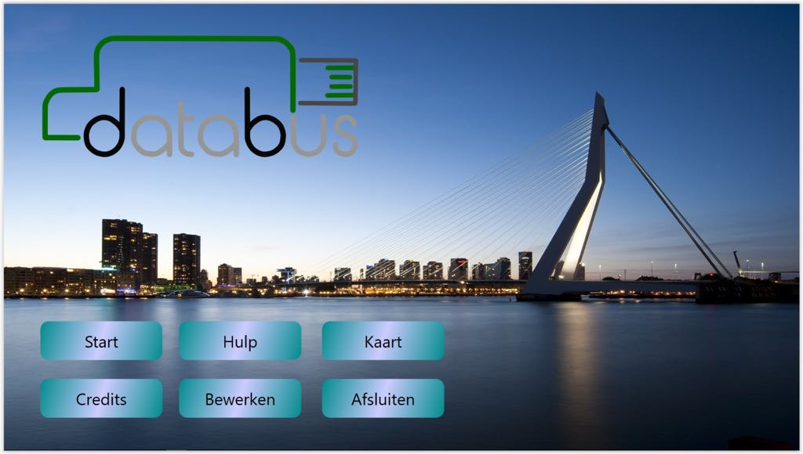
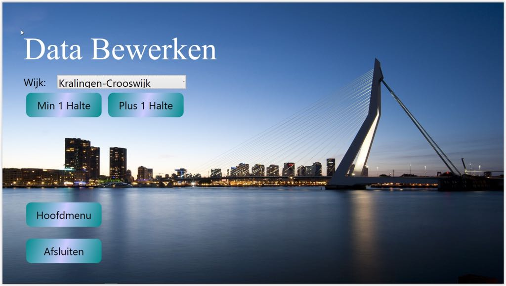
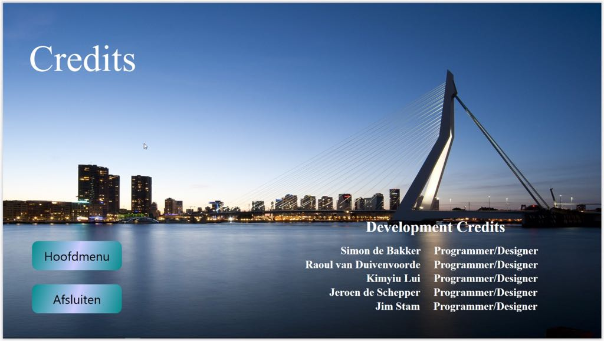
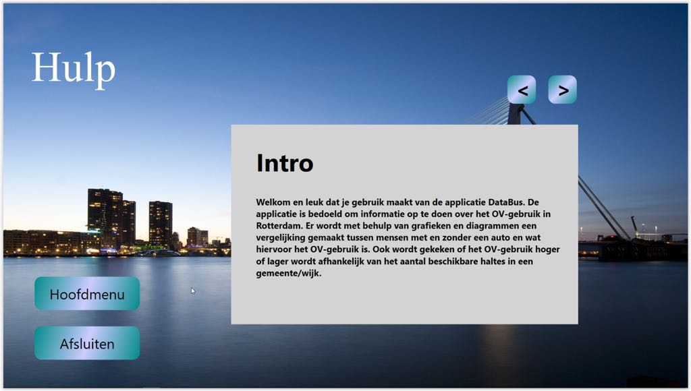
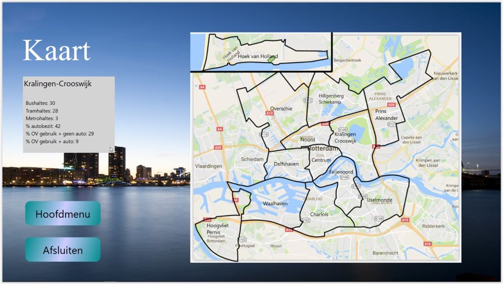
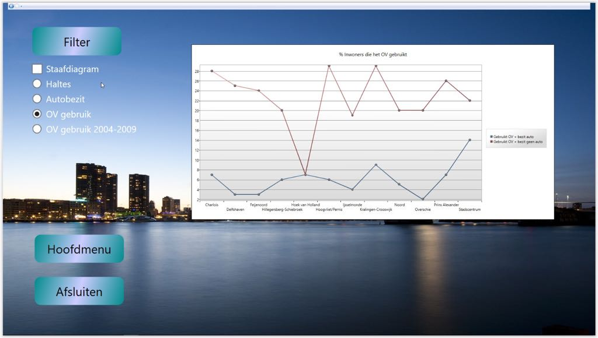
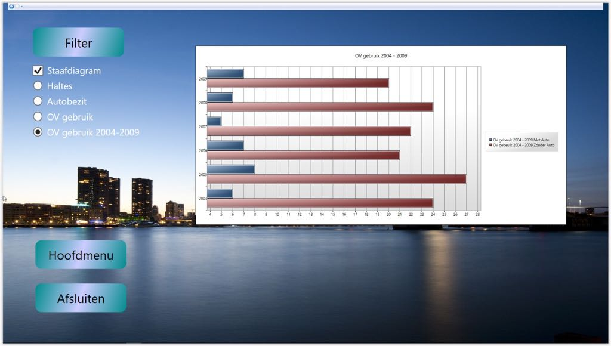

## DataBus Data Visualization

Data visualization programme made in C#/Wpf. Created during the first year of the Computer Science programme of the Rotterdam University of Applied Sciences.

## Screenshots

<table>
    <tr>
        <td>
            
        </td>
    </tr>
</table>
<table>
    <tr>
        <td>
            
        </td>
        <td>
            
        </td>
    </tr>
</table>
<table>
    <tr>
        <td>
            
        </td>
        <td>
            
        </td>
    </tr>
</table>
<table>
    <tr>
        <td>
            
        </td>
        <td>
            
        </td>
    </tr>
</table>

## Details

The application visualizes data from a MySQL database. It shows data in both a bar chart and line chart. The data displayed in this case is public transport and car usage in the city of Rotterdam. This is plotted against the amount of public transport stops located throughout the city. The data can also be edited from within the application.

## Usage

The application requires an active MySQL database to function.